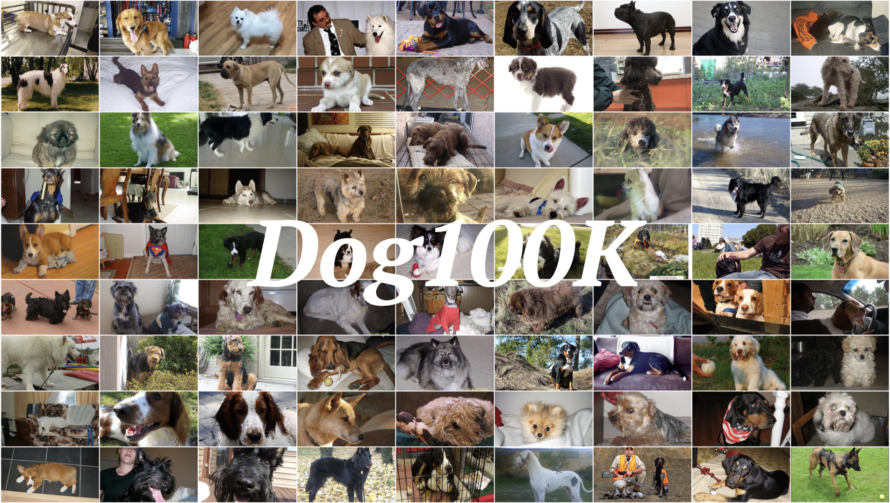
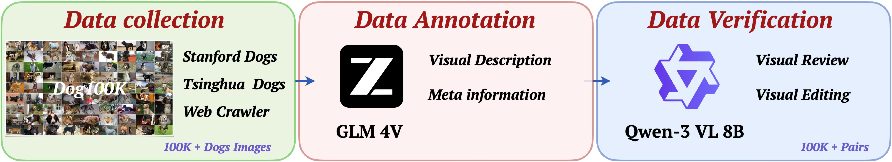

# Dog100K

<p align="center">
  
</p>

<p align="center">
  <a href="https://github.com/choucisan/Dog100K"></a>
  <a href="https://huggingface.co/datasets/choucsan/Dog100K"></a>
  <a href="https://choucisan.github.io/collections/dog100k"></a>
  <a href="LICENSE"></a>
</p>

**Dog100K** is one of the largest high-quality dog image-text alignment datasets, containing over **100,000** image-text pairs. It is designed for image-text retrieval, multimodal learning, and conditional image generation tasks.

---

## Pipeline

<p align="center">
  
</p>

The dataset is constructed through a multi-stage pipeline:

1. **Data Collection**: Dog images are gathered from diverse sources to ensure broad coverage of breeds, scenes, and poses.
2. **Quality Filtering**: Images are filtered for resolution, relevance, and diversity to remove low-quality samples.
3. **Annotation**: Each image is annotated with fine-grained natural language descriptions, including breed, action, scene, and whether humans or multiple dogs are present.
4. **Validation**: Annotations are reviewed and validated for accuracy and consistency.

---

## Dataset Overview

- **Total Samples**: 103,508 image-text pairs
- **Image Format**: JPEG, stored in `data/` directory
- **Annotation Format**: JSONL (`Dog100K.jsonl`), one JSON object per line

| Field | Type | Description |
|-------|------|-------------|
| `filename` | string | Image filename (e.g., `00000001.jpg`) |
| `has_human` | bool | Whether a human is present in the image |
| `multiple_dogs` | bool | Whether multiple dogs appear in the image |
| `scene` | string | Brief scene description |
| `description` | string | Detailed natural language description |

**Example:**
```json
{
  "filename": "00000001.jpg",
  "has_human": false,
  "multiple_dogs": false,
  "scene": "bed with colorful blanket",
  "description": "A small dog with light-colored fur is sitting on a colorful blanket, wearing a light blue shirt. The dog has its mouth open and ears perked up, appearing alert and happy."
}
```

---

## Highlights

- **Large Scale**: 103,508 image-text pairs covering diverse dog breeds, poses, and scenes.
- **Fine-grained Annotations**: Each image is accompanied by a natural language description with rich semantic information.
- **High Diversity**: Various lighting conditions, backgrounds, and viewpoints to enhance model generalization.
- **Open Source**: Freely available for academic research and industrial applications.

---

## Quick Start

Load the dataset directly from Hugging Face:

```python
from datasets import load_dataset

# Load from Hugging Face Hub
dataset = load_dataset("choucsan/Dog100K", split="train")

# Access a sample
sample = dataset[0]
print(sample["description"])
image = sample["image"]  # PIL Image object
image.show()
```

Or load locally:

```python
import json
from PIL import Image

with open("Dog100K.jsonl", "r") as f:
    samples = [json.loads(line) for line in f]

sample = samples[0]
img = Image.open(f"data/{sample['filename']}")
print(sample["description"])
```

---

## Applications

- **Image-Text Retrieval**: Cross-modal search using image-text correspondence.
- **Image Captioning**: Automatic natural language description generation.
- **Conditional Image Generation**: Text-to-image synthesis with DiT, Stable Diffusion, CogView3, etc.
- **Multimodal Contrastive Learning**: Visual-language fusion for CLIP, BLIP, and similar frameworks.

---

## Download

- **Hugging Face**: [datasets/choucsan/Dog100K](https://huggingface.co/datasets/choucsan/Dog100K)
- **Quark Netdisk**: [Download Link](https://pan.quark.cn/s/847c986bb883)

---

## Contact

[choucisan@gmail.com](mailto:choucisan@gmail.com)
